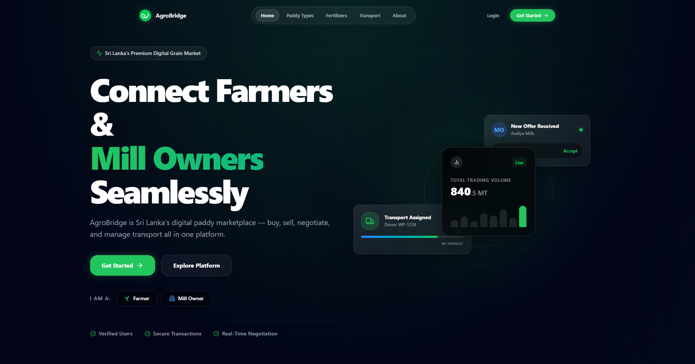
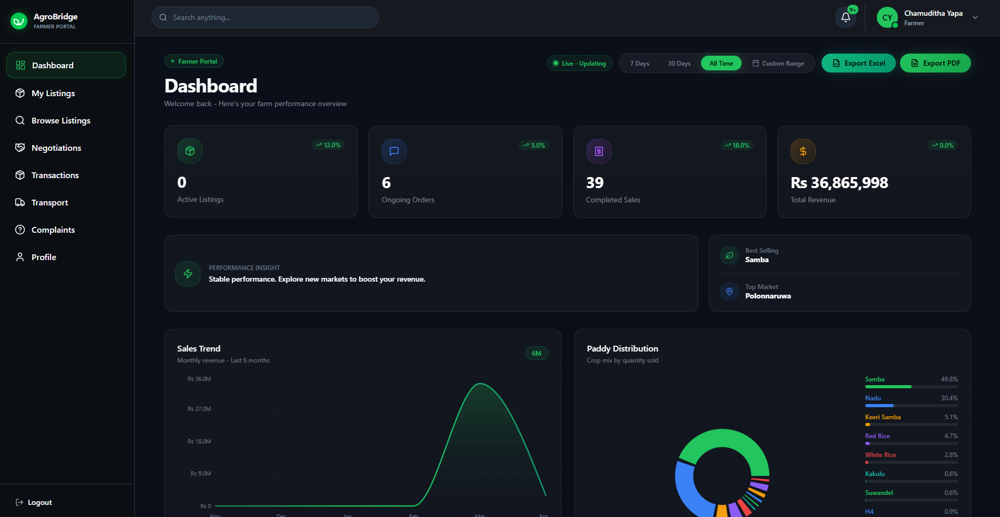
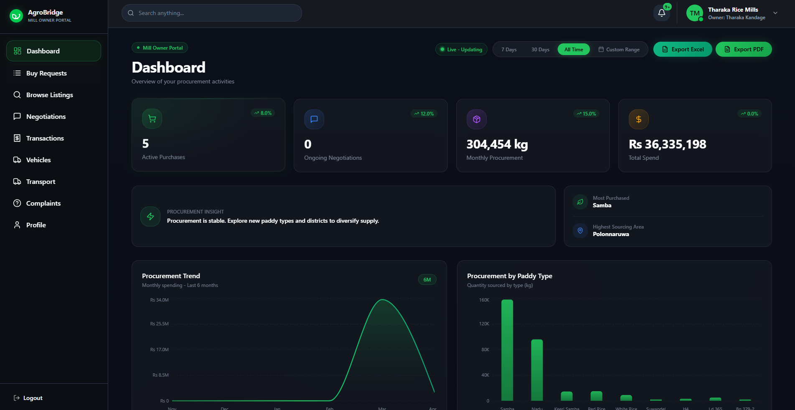
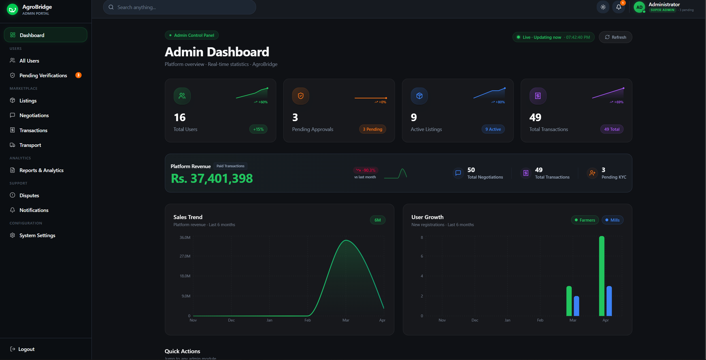
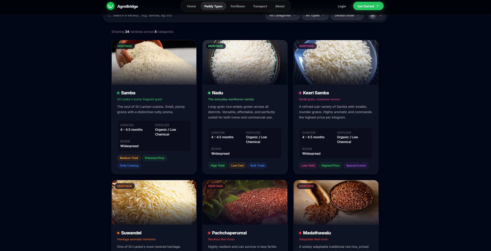
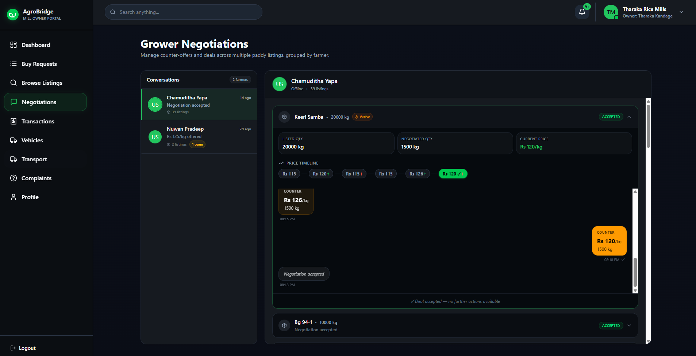

<div align="center">
  

  # AgroBridge
  **"Connecting Farmers & Mill Owners Seamlessly"**

  [](#)
  [](#)
  [](#)
</div>

---

## 1. Overview
AgroBridge is a full-stack digital platform designed to connect farmers and mill owners in Sri Lanka’s paddy supply chain. It enables seamless trading, negotiation, and transport coordination — all in one unified, high-fidelity platform featuring state-of-the-art, glassmorphism design.

---

## 2. Features

### 👨‍🌾 Farmer
- **Listings:** Create and manage customized paddy listings
- **Requests:** View and respond directly to buy requests
- **Negotiations:** Engage in real-time, interactive price negotiations
- **History:** Track ongoing transactions and historical sales data

### 🏭 Mill Owner
- **Requests:** Post and manage targeted buy requests
- **Marketplace:** Browse a comprehensive marketplace of available farmer listings
- **Negotiations:** Negotiate terms directly with farmers
- **Logistics:** Manage purchases, stock, and overarching logistics

### 🚚 Transport
- **Coordination:** Assign drivers for order pickups
- **Tracking:** Track end-to-end transport status
- **Notifications:** Mock SMS notifications for delivery milestone updates

### 📊 Analytics
- **Reports:** Generate and export detailed reports in PDF and Excel formats
- **Filtering:** Custom date range filtering and data sorting
- **Insights:** Visual dashboard insights with dynamic charts

### 🔐 Authentication
- **Verification:** Secure email verification system blocking unverified accounts
- **Access Control:** Route-protected, role-based access (Farmer, Mill Owner, Admin)
- **Business Vetting:** Profile verification workflows for legitimate business operations

---

## 3. Tech Stack

| Category | Technologies Used |
| :--- | :--- |
| **Frontend** | React.js, Tailwind CSS, Vite, Framer Motion |
| **Backend** | Node.js, Express.js |
| **Database** | MongoDB |
| **Utilities** | jsPDF (PDF export), Excel export tools, Nodemailer (Email) |
| **Design** | Modern dark-themed SaaS UI, Glassmorphism |

---

## 4. Screenshots

### 🌐 Landing Page


<br/><br/>

### 👨‍🌾 Farmer Dashboard


<br/><br/>

### 🏭 Mill Owner Dashboard


<br/><br/>

### 🛠 Admin Dashboard


<br/><br/>

### 🌾 Paddy Types


<br/><br/>

### 💬 Negotiations


---

## 5. Project Structure

```text
frontend/
  src/
    assets/
    components/
    pages/
    
backend/
  controllers/
  routes/
  models/
```

---

## 6. Installation

1️⃣ **Clone the repository**
```bash
git clone https://github.com/your-username/agrobridge.git
cd agrobridge
```

2️⃣ **Install dependencies and run (Frontend)**
```bash
cd frontend
npm install
npm run dev
```

3️⃣ **Install dependencies and run (Backend)**
```bash
cd backend
npm install
npm run server
```

---

## 7. Environment Variables

Create a `.env` file in the `backend` directory with the following keys:

```env
PORT=5000
MONGO_URI=your_mongodb_connection
JWT_SECRET=your_secret
EMAIL_USER=your_email
EMAIL_PASS=your_password
```

---

## 8. Future Improvements
- 📱 Mobile app version for accessibility in remote areas
- 🤖 AI-based price recommendations based on market trends
- 💳 Secure payment gateway integration
- 📡 Real SMS verification and status integration (e.g., Twilio)

---

## 9. Author

**Eranda Buddhika**  
Undergraduate Computer Science Student

---

## 10. License

This project is developed for **academic purposes and demonstration**.  
⭐ *Inspired by real-world agricultural supply chain challenges in Sri Lanka.*