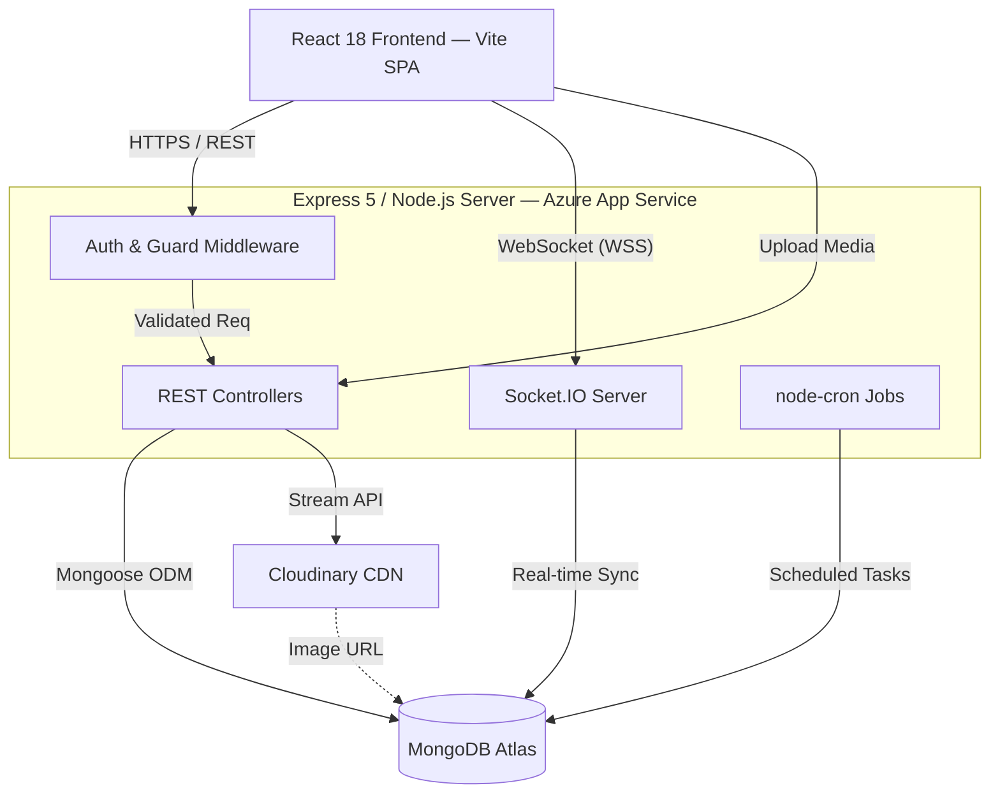

<div align="center">
  

  # AgroBridge

  🚫 This project is for educational and portfolio purposes only.  
  Unauthorized use, reproduction, deployment, or modification is strictly prohibited.

  A production-ready full-stack MERN platform with real-time negotiation, secure authentication, and end-to-end agricultural trading workflow.

  **Real-time negotiation • Secure authentication • End-to-end supply chain workflow**

  🚀 Deployed on Azure cloud infrastructure with a custom domain

  🌐 **Live Demo**: https://www.agrobridge.dev  
  🔗 **Backend API**: https://agrobridge-backend-a5egezhqeag5brgs.southeastasia-01.azurewebsites.net

  **End-to-end paddy trading — from listing to delivery — on a single platform**

  [](https://github.com/Eranda342/Smart-Paddy-Stock-Supply-Management-System/releases/tag/v0.9.0)
  [](#)
  [](#5-tech-stack)
  [](#17-license)

  [View Repository](https://github.com/Eranda342/Smart-Paddy-Stock-Supply-Management-System) &nbsp;|&nbsp; [Releases](https://github.com/Eranda342/Smart-Paddy-Stock-Supply-Management-System/releases) &nbsp;|&nbsp; [Report an Issue](https://github.com/Eranda342/Smart-Paddy-Stock-Supply-Management-System/issues)
</div>

---

## Key Highlights

- **Complete trade lifecycle** — Listing creation through negotiation, transaction confirmation, transport assignment, and delivery tracking in a single integrated flow
- **Real-time communication** — Socket.IO powers live negotiation chat, instant in-app notification delivery, and dispute chat without polling
- **Three-role system** — Fully isolated dashboards and route guards for Farmer, Mill Owner, and Admin roles, enforced independently on both client and server
- **Fully Mobile Responsive** — Complete mobile-first design across all role dashboards, handling safe-area viewports, mobile drawer navigation, and edge-case z-index stacking
- **Glassmorphism UI** — Dark-themed SaaS interface with consistent glassmorphism design language, animated transitions via Framer Motion
- **Soft-delete architecture** — Deleted user accounts are flagged, not removed; all historical transactions, negotiations, and disputes remain intact and queryable
- **Multi-layer authentication** — Email verification (Nodemailer), JWT session management, and Google OAuth 2.0 supported in parallel
- **Analytics and reporting** — Admin analytics dashboard with PDF (jsPDF) and Excel (xlsx) export capability
- **Socket.IO singleton pattern** — Stable WebSocket connection management with crash-safe Proxy pattern preventing teardown errors on logout

---

## 1. Overview

AgroBridge digitises Sri Lanka's paddy supply chain by providing a structured, transparent marketplace where farmers and mill owners can trade directly. The platform covers the entire transaction lifecycle — from stock listing and price negotiation through to transport coordination and delivery confirmation — without requiring off-platform communication.

**Designed for three user roles:**

| Role | Primary Responsibility |
| :--- | :--- |
| **Farmer** | List paddy stock, respond to buy requests, negotiate, track deliveries |
| **Mill Owner** | Discover listings, raise buy requests, negotiate, manage logistics |
| **Admin** | Verify users, oversee all activity, resolve disputes, monitor analytics |

---

## 2. Why AgroBridge / Project Impact

AgroBridge demonstrates the design and implementation of a production-ready full-stack system with real-time capabilities, secure authentication, and scalable cloud deployment.

This project demonstrates:
- End-to-end system architecture design
- Real-time communication using WebSockets (Socket.IO)
- Secure authentication flows (JWT + Google OAuth 2.0)
- Cloud-based media handling using Cloudinary
- Production-grade backend security (rate limiting, CORS, helmet, validation)
- Mobile-first responsive SaaS UI design

Agricultural supply chains often suffer from fragmentation, lack of transparency, and reliance on middlemen, leading to unfair pricing for farmers and logistical inefficiencies for buyers. AgroBridge was built to solve this real-world problem by providing a transparent and reliable trading platform.

**Why this system matters:**
- **Real-time Communication:** Eliminates delays in price negotiation and issue resolution through persistent WebSocket connections.
- **Secure Authentication:** Multi-layered security using JWT for session management, Google OAuth 2.0 for seamless onboarding, and mandatory email verification to ensure trusted actors.
- **Scalable Deployment:** Built on a decoupled MERN architecture with Cloudinary for decentralized asset management, deployed to Azure cloud infrastructure.
- **Data Integrity:** A rigorous soft-delete model guarantees that critical historical trade data is never lost, maintaining a perfect audit trail even if users leave the platform.

---

## 3. Architecture Overview

AgroBridge uses a standard client-server architecture with a persistent real-time layer and cloud-native asset management.


```mermaid
graph TD
    Client[React 18 Frontend — Vite SPA]

    subgraph Backend API [Express 5 / Node.js Server — Azure App Service]
        Auth[Auth & Guard Middleware]
        REST[REST Controllers]
        WS[Socket.IO Server]
        Cron[node-cron Jobs]
    end

    DB[(MongoDB Atlas)]
    Cloud[Cloudinary CDN]

    Client -- "HTTPS / REST" --> Auth
    Auth -- "Validated Req" --> REST
    Client -- "WebSocket (WSS)" --> WS
    REST -- "Mongoose ODM" --> DB
    WS -- "Real-time Sync" --> DB
    Cron -- "Scheduled Tasks" --> DB

    Client -- "Upload Media" --> REST
    REST -- "Stream API" --> Cloud
    Cloud -. "Image URL" .-> DB
```

- **Frontend** — React 18 SPA bundled with Vite, deployed to Azure Static Web Apps. All API calls use a configured Axios client. A singleton Socket.IO WebSocket connection is established on login via a Proxy-based singleton pattern (`socket.js`) for safe teardown on logout.
- **Backend** — Node.js/Express 5 server exposing a structured REST API organized by resource. Handles JWT + OAuth authentication middleware, Cloudinary file uploads, Winston-based logging, scheduled background jobs (node-cron), and Socket.IO event emission.
- **Database** — MongoDB Atlas accessed via Mongoose ODM. Active schemas: `User`, `Listing`, `Negotiation`, `Transaction`, `Transport`, `Vehicle`, `Dispute`, `Notification`, `Announcement`, `SystemSetting`.
- **Real-time layer** — Socket.IO rooms scope events to participants. Events include: negotiation offer/counter/accept/reject, in-app notification delivery, dispute chat messages, and dashboard refresh signals.
- **UI/UX** — Dark-themed glassmorphism design system built with Tailwind CSS and Radix UI primitives. Animated transitions and micro-interactions via Framer Motion.

---

## 4. Features

### Farmer

- Create, edit, and manage paddy listings with price, quantity, and location details
- Browse mill owner buy requests and respond directly
- Engage in real-time price negotiations via an interactive chat interface
- Track active and completed transactions with full history
- Coordinate transport and monitor delivery status
- Raise formal complaints through the dispute system
- View account verification status and manage profile documents

### Mill Owner

- Post targeted buy requests for specific paddy varieties
- Browse and filter the full farmer listing marketplace
- Negotiate terms directly with farmers in real time
- Manage vehicles and coordinate delivery logistics
- Track purchases, transport assignments, and transaction history
- View analytics dashboard with procurement trends and PDF/Excel export

### Admin

- Manage all user accounts; approve or reject business verifications
- Oversee all listings, negotiations, and transactions platform-wide
- Handle disputes between farmers and mill owners with real-time chat
- Broadcast system-wide announcements to all users
- View platform-wide analytics with export capability (PDF and Excel)
- Configure system settings and maintenance mode

### Platform-Wide

- Email verification required before account activation
- Google OAuth 2.0 login and registration (Passport.js)
- Real-time in-app notifications with sound alerts via Socket.IO
- Global search bar across listings, users, and negotiations
- Role-based access control with protected routes (client and server)
- Soft-delete system preserving historical data integrity
- Dark-themed glassmorphism UI with animated transitions (Framer Motion)
- Fully mobile responsive across all device sizes and orientations

---

## 5. Tech Stack

| Layer | Technologies |
| :--- | :--- |
| **Frontend** | React 18, Vite, Tailwind CSS, Framer Motion, React Router v7, Radix UI, Socket.IO client |
| **Backend** | Node.js, Express 5, Socket.IO 4, Winston, helmet |
| **Database** | MongoDB Atlas, Mongoose 9 |
| **Authentication** | JSON Web Tokens (JWT), Passport.js, Google OAuth 2.0, bcryptjs |
| **HTTP / Config** | Axios (client), cors, dotenv, express-rate-limit |
| **Email** | Nodemailer (Gmail App Password), custom HTML email templates |
| **Media Storage** | Cloudinary (multer-storage-cloudinary) |
| **Scheduling** | node-cron |
| **Reports** | jsPDF, jspdf-autotable, xlsx |
| **UI Components** | Radix UI primitives, lucide-react icons, recharts, react-hot-toast |
| **Deployment** | Azure Static Web Apps (frontend), Azure App Service (backend) |
| **Domain** | Custom domain — `www.agrobridge.dev` |

> Built with a focus on scalability, security, and real-time performance in a production environment.

---

## 6. API Overview

The backend exposes a RESTful API structured by resource:

| Route | Purpose |
| :--- | :--- |
| `/api/users` | Authentication, profile management, email verification, password policy |
| `/api/auth` | Google OAuth 2.0 initiation and callback, OAuth profile completion |
| `/api/listings` | Paddy listing CRUD, browse and filter marketplace |
| `/api/negotiations` | Real-time offer and counter-offer system |
| `/api/transactions` | Finalized trade agreements |
| `/api/transport` | Logistics assignment and delivery tracking |
| `/api/vehicles` | Vehicle management for mill owners |
| `/api/disputes` | Dispute creation, resolution, and real-time chat |
| `/api/notifications` | In-app notification fetch and mark-as-read |
| `/api/reports` | Admin report generation (PDF/Excel) |
| `/api/analytics` | Platform-wide analytics data |
| `/api/dashboard` | Role-specific KPI dashboard data |
| `/api/admin` | Admin user and platform management |

All protected routes require a valid JWT Bearer token and role-based authorization via middleware guards.

---

## 7. System Flow

The core platform workflow progresses through five ordered stages:

```
Listing  →  Negotiation  →  Transaction  →  Transport  →  Delivery
```

| Stage | Actor(s) | Description |
| :--- | :--- | :--- |
| **Listing** | Farmer | Farmer creates a paddy listing specifying variety, quantity, price, and location. Mill Owner can also post a buy request. |
| **Negotiation** | Farmer + Mill Owner | Either party initiates a negotiation. Offers and counter-offers are exchanged in real time via Socket.IO. When both parties agree, the negotiation status moves to `AGREED` then `ACCEPTED`. |
| **Transaction** | System | An accepted negotiation automatically generates a Transaction record linking both parties, the listing, and the agreed terms. |
| **Transport** | Mill Owner + Driver | The Mill Owner assigns a vehicle and driver to the transaction. Transport status is updated through pickup, in-transit, and delivered stages. |
| **Delivery** | Both parties | Delivery is confirmed and the transaction is closed. Full history is preserved for both parties and visible to Admin. |

---

## 8. Real-Time System

Socket.IO is integrated throughout the platform to eliminate polling and provide an interactive experience:

- **Negotiation chat** — each negotiation has a dedicated Socket.IO room. Offer submissions, counter-offers, acceptances, and rejections are pushed instantly to both participants.
- **In-app notifications** — server-side events (new negotiation offer, transaction created, dispute opened) emit a notification event to the target user's personal socket room. The notification is simultaneously persisted to MongoDB.
- **Dispute chat** — open disputes have a dedicated real-time chat channel between affected parties and Admin, backed by the `Dispute` model.
- **Dashboard refresh** — the `dashboard_update` event triggers the KPI dashboard to re-fetch live data without a page reload.
- **Connection management** — users join personal socket rooms on authentication. A singleton Proxy pattern (`src/socket.js`) ensures no duplicate connections and prevents crashes during logout teardown.

---

## 9. Data Integrity & Soft-Delete

AgroBridge implements a non-destructive account deletion model:

- When an Admin deletes a user account, the `User` document is **flagged** with `isDeleted: true` — it is never removed from the database.
- All associated records (Listings, Negotiations, Transactions, Disputes) that reference the deleted user remain intact and continue to resolve correctly.
- Auth middleware blocks deleted users from logging in or making API calls immediately upon deletion.
- The Admin panel displays deleted users distinctly (labelled "Deleted User") to preserve visibility into historical platform activity.
- This design prevents orphaned references, broken history views, and data loss while still achieving the operational effect of account removal.

---

## 10. Security & Reliability

AgroBridge implements rigorous security controls to ensure production-grade safety:

- **JWT Authentication** — Stateless, short-lived access tokens (12h expiry) validated on every protected route. The full DB user is fetched on every request to catch live `isBlocked`/`isDeleted` changes.
- **Google OAuth 2.0** — Secure Passport.js strategy providing a seamless verified alternative to password authentication, with JWT handoff on callback.
- **Email Verification** — Strict gating mechanism; accounts are blocked from platform actions until their email is explicitly confirmed.
- **Password Policy** — Enforced complexity rules via `passwordPolicy.js` utility.
- **Role-Based Access Control (RBAC)** — Dedicated middleware guards for `FARMER`, `MILL_OWNER`, and `ADMIN`, enforced independently on both client and server.
- **Rate Limiting** — Global API limiter and a dedicated auth limiter (10 req / 15 min per IP, fully IPv4/IPv6-safe) to prevent brute-force attacks.
- **CORS Origin Whitelisting** — Explicit allowlist including production domains (`www.agrobridge.dev`, `agrobridge.dev`) and development origins.
- **Helmet** — HTTP security headers applied via `helmet` middleware.
- **Socket.IO Security** — WebSocket connections require auth token handshakes; event emissions are scoped to validated user rooms.
- **Input Validation & Error Handling** — Centralized error handlers, schema validations, and a global `asyncHandler` wrapper catch malformed requests before state mutations occur.
- **Soft-Delete System** — Non-destructive account deletion preserves complete platform audit trails.
- **Winston Logging** — Structured server-side logging via `logger.js` for operational monitoring.

---

## 11. Folder Structure

```
Smart-Paddy-Stock-Supply-Management-System/
├── backend/
│   ├── config/          # Database connection, Passport OAuth strategy
│   ├── controllers/     # Route handler logic (user, listing, negotiation, etc.)
│   ├── middleware/       # Auth guards, role checks, rate limiters, error handlers
│   ├── models/          # Mongoose schemas (User, Listing, Negotiation, Transaction,
│   │                    #   Transport, Vehicle, Dispute, Notification, Announcement,
│   │                    #   SystemSetting)
│   ├── routes/          # Express route definitions (13 route files)
│   ├── jobs/            # node-cron scheduled tasks (e.g. auto-dispute generation)
│   ├── utils/           # Shared helpers (email, tokens, PDF, validators, logger,
│   │                    #   password policy, SMS stub)
│   ├── scripts/         # One-off data migration scripts
│   ├── server.js        # Entry point — Express app, Socket.IO, middleware
│   └── .env.example     # Environment variable template
│
├── frontend/
│   └── src/
│       ├── api/         # Axios API client configuration
│       ├── app/
│       │   ├── pages/   # Route-level components
│       │   │   ├── farmer/       # Dashboard, Listings, Negotiations, Transactions,
│       │   │   │                 # Transport, Disputes, Profile, BrowseListings
│       │   │   ├── mill-owner/   # Dashboard, Negotiations, Transactions,
│       │   │   │                 # Transport, Vehicles, Disputes, Profile
│       │   │   ├── admin/        # Dashboard, Users, Listings, Negotiations,
│       │   │   │                 # Transactions, Transport, Disputes, Reports,
│       │   │   │                 # Analytics, Announcements, Settings
│       │   │   └── common/       # TransactionDetails, shared flows
│       │   ├── layouts/ # Role-specific layout wrappers (FarmerLayout,
│       │   │            # MillOwnerLayout, AdminLayout)
│       │   ├── contexts/# React context providers (AuthContext, ThemeContext)
│       │   └── routes.jsx
│       ├── components/  # Shared UI components (Navbar, NotificationDropdown,
│       │                # GlobalSearchBar, ProtectedRoute, RaiseDisputeModal, etc.)
│       ├── constants/   # Static data (paddy types, categories, etc.)
│       ├── assets/      # Images, icons, paddy variety photos
│       ├── socket.js    # Socket.IO singleton with Proxy-based safe teardown
│       ├── styles/      # Global CSS
│       └── utils/       # Frontend helpers (analyticsEngine, PDF generator,
│                        # formatters, file URL resolver)
│
└── docs/
    └── images/          # README screenshots
```

---

## 12. Screenshots

### Landing Page


<br/>

### Farmer Dashboard


<br/>

### Mill Owner Dashboard


<br/>

### Admin Dashboard


<br/>

### Negotiations


---

## 13. ⚖️ Usage Restrictions

This project is protected and intended strictly for:
- Academic submission
- Personal portfolio demonstration

You are NOT permitted to:
- Copy, reuse, or redistribute this code
- Deploy this project publicly or privately
- Use any part of this system in commercial or non-commercial applications
- Modify or adapt this project for your own use

Any unauthorized use may violate intellectual property rights.

Environment configuration details are intentionally withheld for security reasons.

---

## 14. Known Limitations

- **No server-side pagination** — list endpoints return full datasets; performance degrades with large collections
- **Large frontend bundle** — the main JS chunk is ~2.8 MB (789 KB gzipped); code-splitting is a planned improvement
- **iOS Safari rubber-band overscroll** — when the mobile drawer is open, Safari's momentum scrolling can occasionally reveal content behind the overlay (cosmetic only)
- **Negotiation keyboard compression** — on very short device viewports (< 568px height), the negotiation chat input may be partially compressed by the software keyboard
- **Swagger configuration** — API documentation is hardcoded to `localhost` and requires manual adjustment for production use
- **SMS notifications** — transport milestone alerts stub exists (`sendSMS.js`) but no live SMS gateway is integrated

---

## 15. Future Improvements

- Server-side pagination and cursor-based infinite scroll
- Frontend code-splitting and lazy loading for bundle size reduction
- Live SMS notifications via Twilio or a local Sri Lankan SMS gateway
- AI-assisted price recommendations derived from historical transaction data
- Secure payment gateway integration
- Environment-variable-driven Swagger host configuration for production
- iOS Safari mobile drawer overscroll fix

---

## 16. Author

**Eranda Buddhika**  
Undergraduate, Computer Science

[github.com/Eranda342](https://github.com/Eranda342) &nbsp;|&nbsp; [Project Repository](https://github.com/Eranda342/Smart-Paddy-Stock-Supply-Management-System)

---

## 17. License

This project is NOT open source.

All rights reserved © Eranda Buddhika

No permission is granted to use, copy, modify, or distribute this software in any form without explicit written consent.

---

## 18. Release History

| Release | Date | Classification | Notes |
| :--- | :--- | :--- | :--- |
| [**v0.9.0**](https://github.com/Eranda342/Smart-Paddy-Stock-Supply-Management-System/releases/tag/v0.9.0) | May 2026 | Production Beta | Full trading lifecycle, real-time negotiation, mobile-first redesign, WebSocket auth hardening, Azure deployment, custom domain |