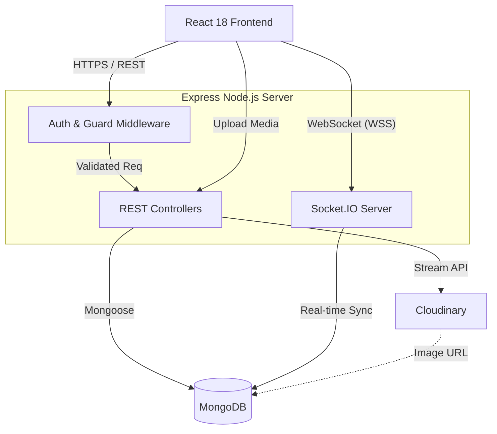
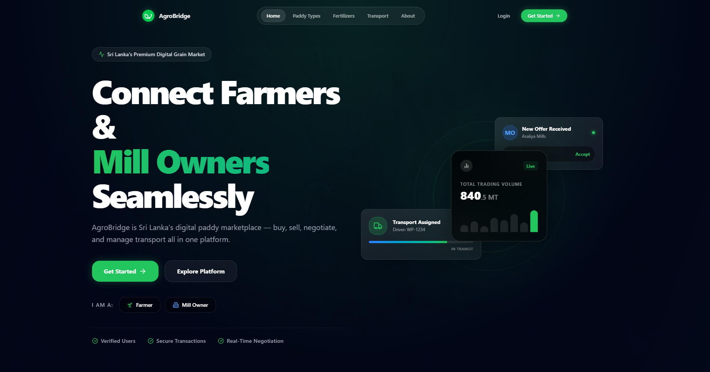
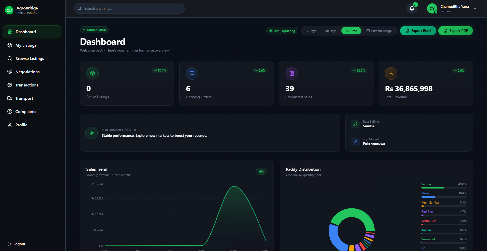
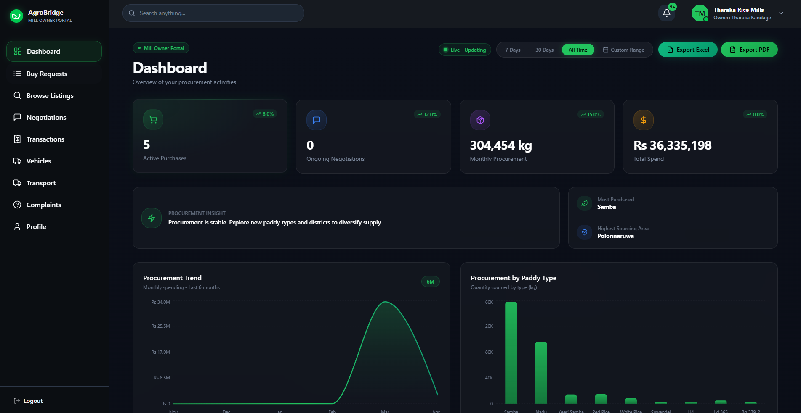
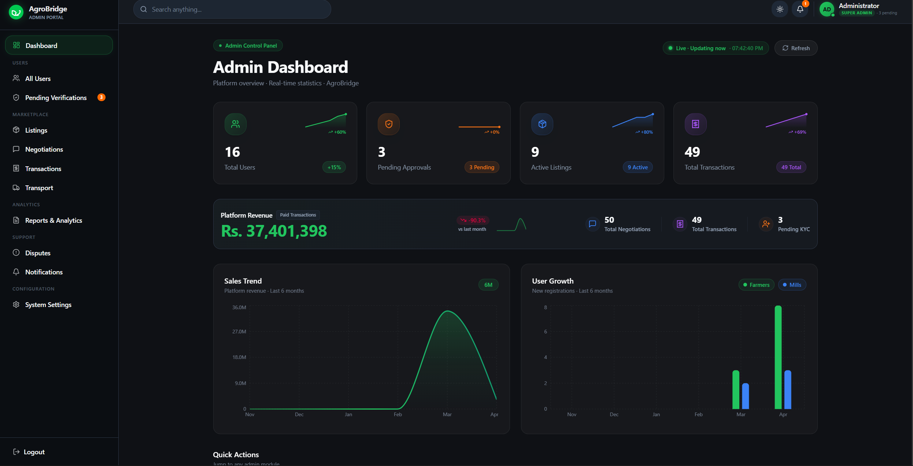
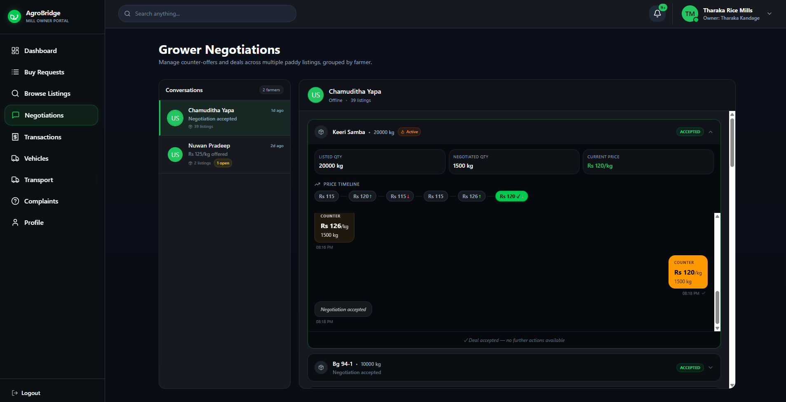

<div align="center">
  

  # AgroBridge

  🚫 This project is for educational and portfolio purposes only.  
  Unauthorized use, reproduction, deployment, or modification is strictly prohibited.

  A production-ready full-stack MERN platform with real-time negotiation, secure authentication, and end-to-end agricultural trading workflow.

  **Real-time negotiation • Secure authentication • End-to-end supply chain workflow**

  🚀 Built and deployed with production-grade backend security on cloud infrastructure

  🌐 **Live Demo**: https://witty-ocean-03e5bca00.7.azurestaticapps.net  
  🔗 **Backend API**: https://agrobridge-backend-a5egezhqeag5brgs.southeastasia-01.azurewebsites.net

  **End-to-end paddy trading — from listing to delivery — on a single platform**

  [](#18-version)
  [](#)
  [](#5-tech-stack)
  [](#17-license)

  [View Repository](https://github.com/Eranda342/Smart-Paddy-Stock-Supply-Management-System) &nbsp;|&nbsp; [Report an Issue](https://github.com/Eranda342/Smart-Paddy-Stock-Supply-Management-System/issues)
</div>

---

## Key Highlights

- **Complete trade lifecycle** — Listing creation through negotiation, transaction confirmation, transport assignment, and delivery tracking in a single integrated flow
- **Real-time communication** — Socket.IO powers live negotiation chat, instant in-app notification delivery, and dispute chat without polling
- **Three-role system** — fully isolated dashboards and route guards for Farmer, Mill Owner, and Admin roles, enforced independently on both client and server
- **Glassmorphism UI** — dark-themed SaaS interface built with Tailwind CSS and Framer Motion; consistent glassmorphism design language across all role dashboards
- **Soft-delete architecture** — deleted user accounts are flagged, not removed; all historical transactions, negotiations, and disputes remain intact and queryable
- **Multi-layer authentication** — email verification (Nodemailer), JWT session management, and Google OAuth 2.0 supported in parallel
- **Analytics and reporting** — admin analytics dashboard with PDF (jsPDF) and Excel (ExcelJS) export capability

---

## 1. Overview

AgroBridge digitises Sri Lanka's paddy supply chain by providing a structured, transparent marketplace where farmers and mill owners can trade directly. The platform covers the entire transaction lifecycle — from stock listing and price negotiation through to transport coordination and delivery confirmation — without requiring off-platform communication.

**Designed for three user roles:**

| Role | Primary Responsibility |
| :--- | :--- |
| **Farmer** | List paddy stock, respond to buy requests, negotiate, track deliveries |
| **Mill Owner** | Discover listings, raise buy requests, negotiate, manage logistics |
| **Admin** | Verify users, oversee all activity, resolve disputes, monitor analytics |

---

## 2. Why AgroBridge / Project Impact

AgroBridge demonstrates the design and implementation of a production-ready full-stack system with real-time capabilities, secure authentication, and scalable cloud deployment.

This project demonstrates:
- End-to-end system architecture design
- Real-time communication using WebSockets (Socket.IO)
- Secure authentication flows (JWT + Google OAuth)
- Cloud-based media handling using Cloudinary
- Production-grade backend security (rate limiting, CORS, validation)

Agricultural supply chains often suffer from fragmentation, lack of transparency, and reliance on middlemen, leading to unfair pricing for farmers and logistical inefficiencies for buyers. AgroBridge was built to solve this real-world problem by providing a transparent and reliable trading platform.

**Why this system matters:**
- **Real-time Communication:** Eliminates delays in price negotiation and issue resolution through persistent WebSocket connections.
- **Secure Authentication:** Multi-layered security using JWT for session management, Google OAuth 2.0 for seamless onboarding, and mandatory email verification to ensure trusted actors.
- **Scalable Deployment:** Built on a decoupled MERN architecture with Cloudinary for decentralized asset management, making it cloud-ready for high traffic.
- **Data Integrity:** A rigorous soft-delete model guarantees that critical historical trade data is never lost, maintaining a perfect audit trail even if users leave the platform.

---

## 3. Architecture Overview

AgroBridge uses a standard client-server architecture with a persistent real-time layer and cloud-native asset management.


```mermaid
graph TD
    Client[React 18 Frontend]
    
    subgraph Backend API [Express Node.js Server]
        Auth[Auth & Guard Middleware]
        REST[REST Controllers]
        WS[Socket.IO Server]
    end
    
    DB[(MongoDB)]
    Cloud[Cloudinary]
    
    Client -- "HTTPS / REST" --> Auth
    Auth -- "Validated Req" --> REST
    Client -- "WebSocket (WSS)" --> WS
    REST -- "Mongoose" --> DB
    WS -- "Real-time Sync" --> DB
    
    Client -- "Upload Media" --> REST
    REST -- "Stream API" --> Cloud
    Cloud -. "Image URL" .-> DB
```

- **Frontend** — React 18 SPA bundled with Vite. All API calls are made via Axios to the Express REST API. A persistent Socket.IO WebSocket connection is established on login for real-time event delivery.
- **Backend** — Node.js/Express 5 server exposing a structured REST API organised by resource (users, listings, negotiations, transactions, transport, disputes, analytics, notifications). Handles authentication middleware, remote file uploads (Cloudinary), scheduled background jobs (node-cron), and Socket.IO event emission.
- **Database** — MongoDB accessed via Mongoose ODM. Active schemas: `User`, `Listing`, `Negotiation`, `Transaction`, `Transport`, `Vehicle`, `Dispute`, `DisputeChat`, `Notification`, `Announcement`, `SystemSetting`.
- **Real-time layer** — Socket.IO rooms are used to scope events to the relevant participants. Events emitted include: negotiation offer/counter/accept/reject, in-app notification delivery, and dispute chat messages.
- **UI/UX** — Dark-themed glassmorphism design system implemented with Tailwind CSS utility classes. Animated transitions and micro-interactions delivered via Framer Motion.

---

## 4. Features

### Farmer

- Create, edit, and manage paddy listings with price, quantity, and location details
- Browse mill owner buy requests and respond directly
- Engage in real-time price negotiations via an interactive chat interface
- Track active and completed transactions with full history
- Coordinate transport and monitor delivery status
- Raise formal complaints through the dispute system

### Mill Owner

- Post targeted buy requests for specific paddy varieties
- Browse and filter the full farmer listing marketplace
- Negotiate terms directly with farmers
- Manage vehicles and coordinate logistics
- Track purchases, transport assignments, and transaction history

### Admin

- Manage all user accounts; approve or reject business verifications
- Oversee all listings, negotiations, and transactions platform-wide
- Handle disputes between farmers and mill owners
- Broadcast system-wide announcements
- View analytics dashboards with export capability (PDF and Excel)
- Configure system settings and maintenance mode

### Platform-Wide

- Email verification required before account activation
- Google OAuth 2.0 login and registration
- Real-time in-app notifications via Socket.IO
- Role-based access control with protected routes (client and server)
- Soft-delete system preserving historical data integrity
- PDF and Excel report generation
- Dark-themed glassmorphism UI with animated transitions (Framer Motion)

---

## 5. Tech Stack

| Layer | Technologies |
| :--- | :--- |
| **Frontend** | React 18, Vite, Tailwind CSS, Framer Motion, React Router v6, Axios, Socket.IO client |
| **Backend** | Node.js, Express 5, Socket.IO |
| **Database** | MongoDB, Mongoose |
| **Authentication** | JSON Web Tokens (JWT), Passport.js, Google OAuth 2.0, bcryptjs |
| **HTTP / Config** | Axios (client), cors, dotenv |
| **Email** | Nodemailer (Gmail App Password) |
| **Media Storage** | Cloudinary |
| **Scheduling** | node-cron |
| **Reports** | jsPDF, jspdf-autotable, ExcelJS |
| **UI / Design** | Glassmorphism design system, dark SaaS theme, Framer Motion animations |

> Built with a focus on scalability, security, and real-time performance in a production-like environment.

---

## 6. API Overview

The backend exposes a RESTful API structured by resource:

- `/api/users` — authentication, profile, email verification
- `/api/listings` — paddy listings management
- `/api/negotiations` — real-time offer and counter-offer system
- `/api/transactions` — finalized agreements
- `/api/transport` — logistics and delivery tracking
- `/api/disputes` — dispute resolution and chat system

All protected routes require JWT authentication and role-based authorization.

---

## 7. System Flow

The core platform workflow progresses through five ordered stages:

```
Listing  →  Negotiation  →  Transaction  →  Transport  →  Delivery
```

| Stage | Actor(s) | Description |
| :--- | :--- | :--- |
| **Listing** | Farmer | Farmer creates a paddy listing specifying variety, quantity, price, and location. Mill Owner can also post a buy request. |
| **Negotiation** | Farmer + Mill Owner | Either party initiates a negotiation. Offers and counter-offers are exchanged in real time via Socket.IO chat. When both parties agree, the negotiation is marked accepted. |
| **Transaction** | System | An accepted negotiation automatically generates a Transaction record linking both parties, the listing, and the agreed terms. |
| **Transport** | Mill Owner + Driver | The Mill Owner assigns a vehicle and driver to the transaction. Transport status is updated through pickup, in-transit, and delivered stages. |
| **Delivery** | Both parties | Delivery is confirmed and the transaction is closed. Full history is preserved for both parties and visible to Admin. |

---

## 8. Real-Time System

Socket.IO is integrated throughout the platform to eliminate polling and provide an interactive experience:

- **Negotiation chat** — each negotiation has a dedicated Socket.IO room. Offer submissions, counter-offers, acceptances, and rejections are pushed instantly to both participants.
- **In-app notifications** — server-side events (e.g. new negotiation offer, transaction created, dispute opened) emit a notification event to the target user's socket room. The notification is simultaneously persisted to the `Notification` collection in MongoDB.
- **Dispute chat** — open disputes have a dedicated real-time chat channel between the affected parties and the Admin, backed by the `DisputeChat` model.
- **Connection management** — users join personal socket rooms on authentication. Rooms are identified by user ID, ensuring notifications are delivered only to the correct recipient.

---

## 9. Data Integrity & Soft-Delete

AgroBridge implements a non-destructive account deletion model:

- When an Admin deletes a user account, the `User` document is **flagged** with a `isDeleted: true` field — it is never removed from the database.
- All associated records (Listings, Negotiations, Transactions, Disputes) that reference the deleted user remain intact and continue to resolve correctly.
- Auth middleware blocks deleted users from logging in or making API calls immediately upon deletion.
- The Admin panel displays deleted users distinctly (labelled "Deleted User") to preserve visibility into historical platform activity.
- This design prevents orphaned references, broken history views, and data loss while still achieving the operational effect of account removal.

---

## 10. Folder Structure

```
Smart-Paddy-Stock-Supply-Management-System/
├── backend/
│   ├── config/          # Database connection, Passport strategy
│   ├── controllers/     # Route handler logic
│   ├── middleware/       # Auth guards, role checks, error handlers
│   ├── models/          # Mongoose schemas
│   ├── routes/          # Express route definitions
│   ├── jobs/            # node-cron scheduled tasks
│   ├── utils/           # Shared helpers (email, tokens, Cloudinary etc.)
│   ├── docs/            # Swagger API specification
│   ├── server.js        # Entry point
│   └── .env.example     # Environment variable template
│
├── frontend/
│   └── src/
│       ├── api/         # Axios API client modules
│       ├── app/
│       │   ├── pages/   # Route-level components (farmer/, mill-owner/, admin/)
│       │   ├── layouts/ # Role-specific layout wrappers
│       │   ├── contexts/# React context providers
│       │   └── routes.jsx
│       ├── components/  # Shared UI components
│       ├── constants/   # Static data (paddy types, categories, etc.)
│       ├── assets/      # Images, icons, paddy variety photos
│       ├── styles/      # Global CSS
│       └── utils/       # Frontend helpers (PDF generator, formatters)
│
└── docs/
    └── images/          # README screenshots
```

---

## 11. Screenshots

### Landing Page



<br/>

### Farmer Dashboard



<br/>

### Mill Owner Dashboard



<br/>

### Admin Dashboard



<br/>

### Negotiations



---

## 12. ⚖️ Usage Restrictions

This project is protected and intended strictly for:
- Academic submission
- Personal portfolio demonstration

You are NOT permitted to:
- Copy, reuse, or redistribute this code
- Deploy this project publicly or privately
- Use any part of this system in commercial or non-commercial applications
- Modify or adapt this project for your own use

Any unauthorized use may violate intellectual property rights.

Environment configuration details are intentionally withheld for security reasons.

---

## 13. Security & Reliability

AgroBridge implements rigorous security controls to ensure production-grade safety for both user data and system operations:

- **JWT Authentication** — Stateless, short-lived access tokens validated on every protected route.
- **Google OAuth 2.0** — Secure passport-google-oauth20 strategy providing a seamless, verified alternative to password authentication.
- **Email Verification** — Strict gating mechanism; accounts are blocked from platform actions until their email is explicitly confirmed via Nodemailer.
- **Role-Based Access Control (RBAC)** — Dedicated middleware guards for `FARMER`, `MILL_OWNER`, and `ADMIN`, strictly enforced independently on both the React client and Express API.
- **Rate Limiting** — Global and route-specific API rate limiting (fully IPv6-safe) to prevent brute-force and DDoS attacks.
- **CORS Origin Whitelisting** — Explicit Cross-Origin Resource Sharing policy blocking unauthorized domains, correctly mapped to production domains.
- **Socket.IO Security** — WebSocket connections mandate authentication handshakes, and event emissions are locked strictly to validated user rooms to prevent data leakage.
- **Input Validation & Error Handling** — Centralized error handlers and schema validations catch malformed requests before state mutations occur.
- **Soft-Delete System** — User deletions are non-destructive; related transactions, negotiations, and disputes are preserved to maintain platform audit trails.

---

## 14. Known Limitations

- **No server-side pagination** — list endpoints return full datasets; performance degrades with large collections
- **Large frontend bundle** — the main JS chunk exceeds 500 kB (surfaced during `vite build`); code-splitting is a planned improvement
- **Swagger configuration** — API documentation is hardcoded to `localhost` and requires manual adjustment for production use
- **SMS notifications** — transport milestone alerts are mocked; no live Twilio or equivalent SMS integration exists

---

## 15. Future Improvements

- Server-side pagination and cursor-based infinite scroll
- Frontend code-splitting and lazy loading for bundle size reduction
- Improved mobile responsiveness across all role dashboards
- Live SMS notifications via Twilio or a local Sri Lankan SMS gateway
- AI-assisted price recommendations derived from historical transaction data
- Secure payment gateway integration
- Environment-variable-driven Swagger host configuration for production

---

## 16. Author

**Eranda Buddhika**  
Undergraduate, Computer Science

[github.com/Eranda342](https://github.com/Eranda342) &nbsp;|&nbsp; [Project Repository](https://github.com/Eranda342/Smart-Paddy-Stock-Supply-Management-System)

---

## 17. License

This project is NOT open source.

All rights reserved © Eranda Buddhika

No permission is granted to use, copy, modify, or distribute this software in any form without explicit written consent.

---

## 18. Version

| Release | Date | Notes |
| :--- | :--- | :--- |
| **v1.0.0** | April 2026 | First stable release — full trading lifecycle, real-time negotiation, three-role dashboards, dispute system, analytics export, Cloudinary migration |